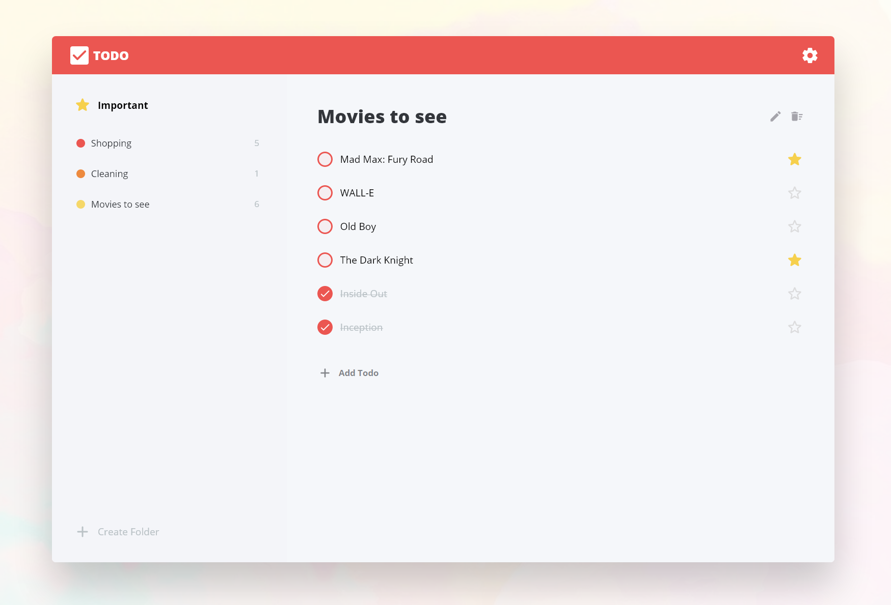

  
  

✔ **Vanilla Todo App**
=======

vanilla-todo-app은 vanilla.js로 Todo App을 만들어보는 연습 프로젝트 입니다.  
vanilla.js로 컴포넌트 기반 작성법을 연구해 볼 수 있습니다.  
작은 단위의 컴포넌트들을 만들고 조합하는게 목표입니다.  
  

# Demo
[Todo App Demo](https://tuna70803.github.io/vanilla-todo-app/)
  

# 기능  
- 폴더에서 여러 Todo 아이템을 관리 가능  
- Todo 아이템에 완료 또는 중요함을 설정 가능  
- 중요함을 설정한 아이템만 따로 볼 수 있는 기능  
  

# Frontend
Todo App Client는 frontend 프로젝트에서 구현합니다.  
자세한 내용은 [frontend/README.md](frontend/README.md)를 읽어보세요  
  

# Backend
Todo App Server는 backend 프로젝트에서 구현합니다.  
자세한 내용은 [backend/README.md](backend/README.md)를 읽어보세요  
 

### 백엔드가 왜 필요하죠?
* backend 프로젝트는 fetch API 실습을 지원합니다.  
